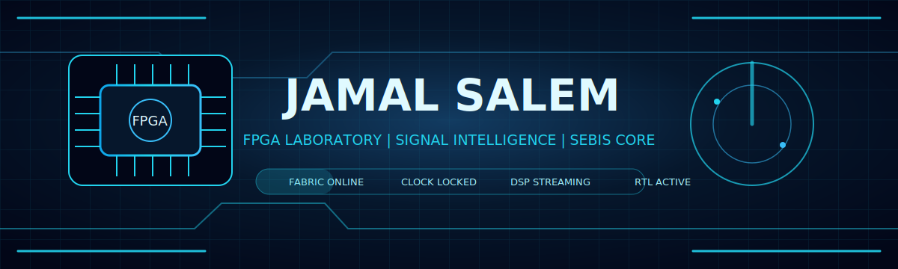
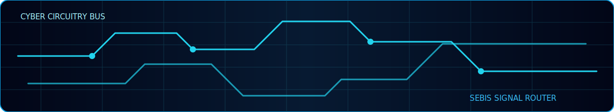
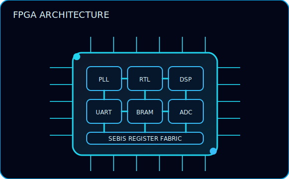
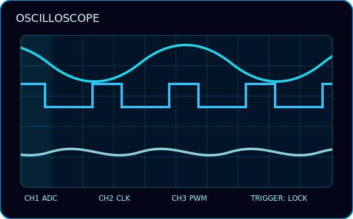
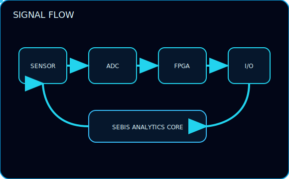
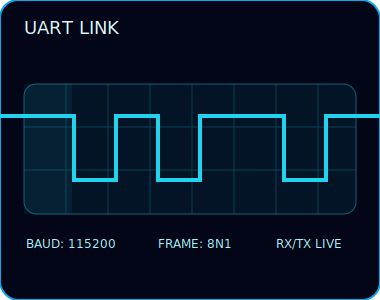
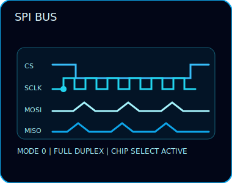
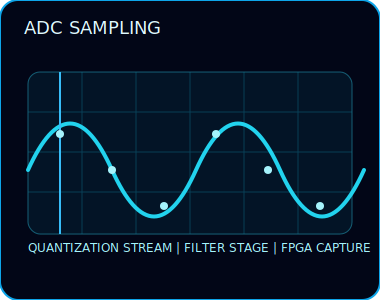
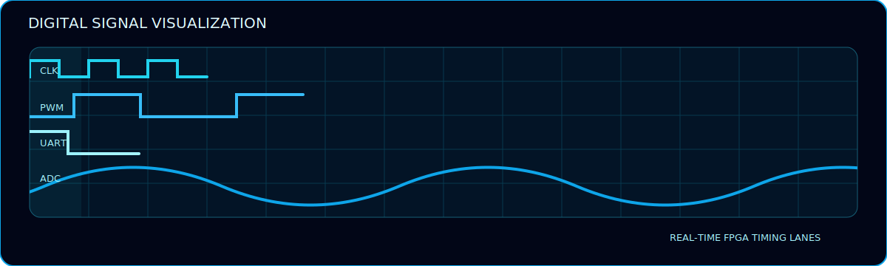
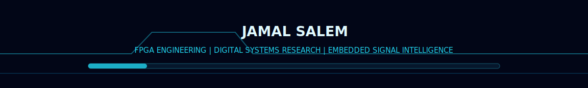

<div align="center">


[](https://git.io/typing-svg)

</div>


```text
┌──────────────────────────────────────────────────────────────────────────────┐
│                          CYBER ENGINEERING CONSOLE                           │
├───────────────────────────────┬──────────────────────────────────────────────┤
│ OPERATOR                      │ Jamal Salem                                  │
│ ACTIVE ROLES                  │ Computer Engineer | FPGA Engineer            │
│                               │ Digital Systems Researcher                   │
│                               │ Embedded Systems Engineer | SEBIS Creator    │
│ LAB MODE                      │ Hardware-aware research and system design     │
│ PRIMARY DOMAINS               │ FPGA | HDL | Embedded | DSP | Linux          │
│ SYSTEM STATE                  │ ONLINE                                       │
└───────────────────────────────┴──────────────────────────────────────────────┘
```

---

## FPGA Lab Status

<table>
<tr>
<td width="33%">

```text
┌──────────────────────┐
│  FPGA FABRIC         │
├──────────────────────┤
│ LUT MAP      : READY │
│ BRAM         : READY │
│ PLL CLOCKS   : LOCK  │
│ TIMING       : WATCH │
│ BITSTREAM    : ARMED │
└──────────────────────┘
```

</td>
<td width="33%">

```text
┌──────────────────────┐
│  SIGNAL BAY          │
├──────────────────────┤
│ ADC STREAM   : LIVE  │
│ PWM OUT      : SYNC  │
│ UART RX/TX   : OPEN  │
│ SPI BUS      : SCAN  │
│ NOISE FLOOR  : LOW   │
└──────────────────────┘
```

</td>
<td width="33%">

```text
┌──────────────────────┐
│  EMBEDDED NODE       │
├──────────────────────┤
│ C RUNTIME    : HOT   │
│ ASM PATH     : FAST  │
│ LINUX EDGE   : READY │
│ ISR LATENCY  : TRACE │
│ TELEMETRY    : FLOW  │
└──────────────────────┘
```

</td>
</tr>
</table>

---

## SEBIS Core

```text
                         ┌──────────────────────┐
                         │      SEBIS CORE      │
                         │  Signal Engineering  │
                         │  & Built-In Systems  │
                         └──────────┬───────────┘
                                    │
          ┌─────────────────────────┼─────────────────────────┐
          │                         │                         │
          ▼                         ▼                         ▼
┌──────────────────┐      ┌──────────────────┐      ┌──────────────────┐
│ FPGA ACCELERATOR │      │ EMBEDDED CONTROL │      │ SIGNAL ANALYTICS │
├──────────────────┤      ├──────────────────┤      ├──────────────────┤
│ RTL datapaths    │      │ C / Assembly     │      │ ADC inspection   │
│ HDL modules      │      │ Low-level I/O    │      │ DSP pipelines    │
│ Timing closure   │      │ Interrupt logic  │      │ Feature capture  │
└────────┬─────────┘      └────────┬─────────┘      └────────┬─────────┘
         │                         │                         │
         └─────────────────────────▼─────────────────────────┘
                         ┌──────────────────────┐
                         │ CYBER SYSTEM OUTPUT  │
                         │ Observe | Decide | Act│
                         └──────────────────────┘
```

---

## Radar Visualization

```text
                          .----------------.
                     .----'    RF / DSP     '----.
                 .--'                             '--.
              .-'        FPGA FABRIC SCAN            '-.
             /                                           \
            |       315°           │            045°      |
            |                      │                      |
            |          \           │           /          |
            |           \          │          /           |
            |            \     ┌───▼───┐     /            |
            | 270° ────────►   │SEBIS │   ◄──────── 090° |
            |            /     └───▲───┘     \            |
            |           /          │          \           |
            |          /           │           \          |
            |                      │                      |
             \       225°          │           135°      /
              '-.                                      .-'
                 '--.                              .--'
                     '----.                  .----'
                          '------------------'

TRACKING:
[01] Clock drift        stable
[02] UART frame edge    detected
[03] PWM duty window    locked
[04] ADC burst          captured
[05] SPI transfer       active
```

---

## Oscilloscope Bay

```text
CHANNEL A : CLK_100M
     ┌───┐   ┌───┐   ┌───┐   ┌───┐   ┌───┐   ┌───┐
─────┘   └───┘   └───┘   └───┘   └───┘   └───┘   └─────
     0ns     10ns    20ns    30ns    40ns    50ns

CHANNEL B : PWM_OUT
     ┌──────────────┐          ┌──────────────┐
─────┘              └──────────┘              └──────────
     <--- duty --->            <--- duty --->

CHANNEL C : UART_TX
IDLE  START  D0   D1   D2   D3   D4   D5   D6   D7  STOP
────┐ ┌────┐ ┌──┐      ┌──┐ ┌──┐      ┌──┐      ┌────────
    └─┘    └─┘  └──────┘  └─┘  └──────┘  └──────┘

CHANNEL D : ADC_SAMPLE_BUS
────┬────┬────┬────┬────┬────┬────┬────┬────┬────┬────
  7F   83   88   91   9A   A4   B1   C0   B8   9D   86
```

---

<div align="center">



[](https://git.io/typing-svg)

</div>

<p align="center">
  
  
  
  
  
</p>

<div align="center">



</div>

## Live FPGA Laboratory

<table>
  <tr>
    <td width="50%"></td>
    <td width="50%"></td>
  </tr>
  <tr>
    <td width="50%"></td>
    <td width="50%"></td>
  </tr>
</table>

## Protocol Intelligence

<table>
  <tr>
    <td width="33%"></td>
    <td width="33%"></td>
    <td width="33%"></td>
  </tr>
</table>

## Digital Signal Systems

<div align="center">



</div>

## Technology Control Rack

<p align="center">
  
  
  
  
  
  
  
  
  
</p>

## Live Telemetry

<div align="center">


<br />


</div>

## Contribution Activity Graph

<div align="center">

[](https://github.com/JamalSalem)

</div>

<div align="center">



</div>


## Digital Logic Monitor

```text
MODULE: edge_detector.v

        signal_in ───────┐
                          ▼
                   ┌────────────┐
clk ──────────────►│ D FLIP-FLOP│──── signal_d
                   └─────┬──────┘
                         │
                         ▼
signal_in ───────────── XOR ─────────► rising_edge_pulse
signal_d  ──────────────┘

STATUS:
setup margin       : monitored
hold margin        : monitored
metastability path : constrained
output pulse width : 1 clk cycle
```

---

## FPGA Architecture Map

```text
┌──────────────────────────────────────────────────────────────────────────────┐
│                                  FPGA FABRIC                                 │
├──────────────────────────────────────────────────────────────────────────────┤
│                                                                              │
│  ┌──────────────┐     ┌──────────────┐     ┌──────────────┐                 │
│  │ CLOCK / PLL  │────►│ RTL CONTROL  │────►│ DATA PIPELINE│                 │
│  └──────┬───────┘     └──────┬───────┘     └──────┬───────┘                 │
│         │                    │                    │                         │
│         ▼                    ▼                    ▼                         │
│  ┌──────────────┐     ┌──────────────┐     ┌──────────────┐                 │
│  │ UART / SPI   │◄───►│ REGISTER MAP │◄───►│ DSP / FILTER │                 │
│  └──────┬───────┘     └──────┬───────┘     └──────┬───────┘                 │
│         │                    │                    │                         │
│         ▼                    ▼                    ▼                         │
│  ┌──────────────┐     ┌──────────────┐     ┌──────────────┐                 │
│  │ GPIO / PWM   │     │ BRAM BUFFER  │     │ ADC CAPTURE  │                 │
│  └──────────────┘     └──────────────┘     └──────────────┘                 │
│                                                                              │
└──────────────────────────────────────────────────────────────────────────────┘
```

---

## Protocol Analyzer

```text
SPI FRAME CAPTURE
CS    ─────┐                                      ┌─────
           └──────────────────────────────────────┘
SCLK  ─────┐ ┌─┐ ┌─┐ ┌─┐ ┌─┐ ┌─┐ ┌─┐ ┌─┐ ┌─┐ ┌─────
           └─┘ └─┘ └─┘ └─┘ └─┘ └─┘ └─┘ └─┘ └─┘
MOSI       1   0   1   0   1   1   0   1
MISO       0   1   0   1   0   0   1   1

UART FRAME CAPTURE
LINE  ───────┐ ┌────┐    ┌────┐ ┌────┐    ┌────────────
             └─┘    └────┘    └─┘    └────┘
BITS   IDLE  S  D0   D1   D2   D3   D4   D5   D6   D7  STOP

PWM DUTY ANALYSIS
HIGH  ████████████████░░░░░░░░░░░░░░░░  50%
LOW   ░░░░░░░░░░░░░░░░████████████████  50%
```

---

## Technology Control Rack

<div align="center">


</div>

---

## Live Telemetry Widgets

<div align="center">


<br/>


</div>

---

## Contribution Activity Graph

<div align="center">

[](https://github.com/JamalSalem)

</div>

---

## Command Center Footer

```text
┌──────────────────────────────────────────────────────────────────────────────┐
│ JAMAL SALEM                                                                  │
│ FPGA ENGINEERING | DIGITAL SYSTEMS RESEARCH | EMBEDDED SIGNAL INTELLIGENCE   │
├──────────────────────────────────────────────────────────────────────────────┤
│ Console closed? No.                                                          │
│ The clock is still running. The signal is still being measured.              │
└──────────────────────────────────────────────────────────────────────────────┘
```

<div align="center">


</div>


