<div align="center">


[](https://git.io/typing-svg)

</div>

## SYSTEM PROFILE

```text
OPERATOR      : JAMAL SALEM
STATUS        : ONLINE
MODE          : RESEARCH
DOMAIN        : FPGA + EMBEDDED SYSTEMS

CURRENT MISSION:
Exploring digital systems,
signal behavior,
hardware intelligence,
and cyber-physical architectures.
```

<h2 align="center">RADAR INTELLIGENCE SYSTEM</h2>

<p align="center">
  
</p>
